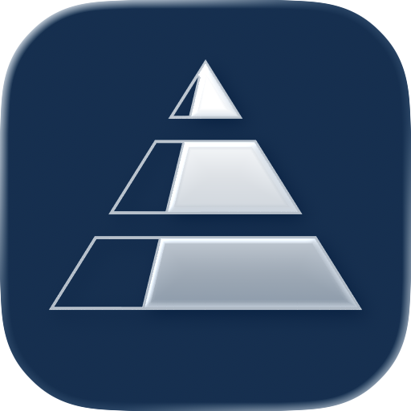
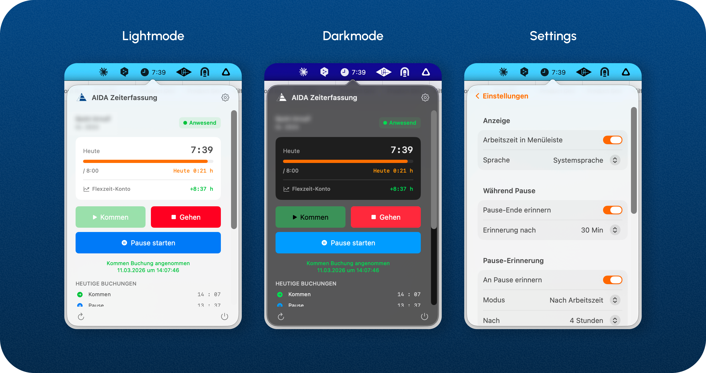

<p align="center">
  
</p>

<h1 align="center">AIDA MenuBar</h1>

<p align="center">
  A native macOS menu bar app for AIDA time tracking.<br>
  Built with Swift and SwiftUI — fast, lightweight, and always one click away.
</p>

<p align="center">
  <a href="../../releases/latest">
    
  </a>
</p>

<p align="center">
  
  
  
  
  
</p>

> **🚧 Early Development** — AIDA MenuBar is currently in active development and only available for internal use with a VPN connection to the AIDA server. A public version with broader compatibility is planned for a future release.

---

## Features

### Core
- **Live time display** in the macOS menu bar (optional)
- **One-click booking** — Clock in, clock out, start/stop break
- **Real-time flextime balance** — cumulative account with live calculation
- **Today's bookings** — chronological timeline of all entries
- **Past days overview** — compact 7-day history with inline bookings

### Smart
- **Auto-sync** every 60 seconds with server-side recalculation
- **VPN detection** with auto-reconnect and offline indicators
- **Break reminders** — configurable notifications (after X hours or at fixed time)
- **End-of-day reminder** — don't forget to clock out
- **Pause duration tracking** with persistent notifications

### Polish
- **Bilingual UI** — German and English, switchable in-app or follows system language
- **Dark Mode** support
- **Keychain integration** — secure credential storage
- **Auto-login** on app launch with saved credentials
- **Update checker** with download link

## Screenshots

<p align="left">
  
</p>

## Requirements

- macOS 13.0 (Ventura) or later
- VPN connection to the AIDA server
- AIDA user credentials

## Installation

### For Users

1. Download `AidaMenuBar.app.zip` from the latest [Release](../../releases)
2. Unzip and move `AidaMenuBar.app` to your **Applications** folder
3. **First launch** (app is unsigned — macOS Gatekeeper will block it by default):
   - **Right-click** (or Control-click) on the app → **Open** → click **Open** in the dialog
   - If you see *"AidaMenuBar can't be opened"* without an Open option:
     1. Go to **System Settings → Privacy & Security**
     2. Scroll down — you'll see a message like *"AidaMenuBar was blocked"*
     3. Click **Open Anyway** → confirm with your password or Touch ID
   - This is only required once. After that the app opens normally.
4. Connect to VPN and sign in with your AIDA credentials

### For Developers

```bash
git clone https://github.com/arnuquint/AidaMenuBar.git
cd AidaMenuBar
open AidaMenuBar.xcodeproj
```

1. Select target **"My Mac"**
2. `Cmd+R` to build & run
3. For release: `Product → Archive → Distribute App → Copy App`

## Architecture

```
AidaMenuBar/
├── AidaMenuBarApp.swift       # App entry, MenuBar setup, AppDelegate
├── ContentView.swift          # Main popover UI (timeline, settings, login)
├── SessionManager.swift       # API client, auth, timers, VPN, state
├── SettingsManager.swift      # UserDefaults for app preferences
├── KeychainService.swift      # macOS Keychain integration
├── UpdateChecker.swift        # GitHub release version check
├── L10n.swift                 # Localization wrapper (DE/EN)
├── Localizable.xcstrings      # String catalog (all translations)
├── AidaLogoView.swift         # AIDA pyramid logo (SVG → Canvas)
└── Assets.xcassets/           # App icon, colors
```

### Data Flow

```
Timer (60s) → RechneBisHeute (server recalc) → buchungen_7Tage (fresh data)
                                                        ↓
                                              Parse: times, bookings, saldo
                                                        ↓
Live Timer (1s) → Interpolate worked minutes since last server fetch
                                                        ↓
                                              Flextime = Vortag + Today's Saldo
```

### API Endpoints

| Endpoint | Method | Purpose |
|----------|--------|---------|
| `central/sessions/` | POST | Login |
| `central/sessions/{id}` | GET | Session validation / Keep-alive |
| `taims/rpc?` | POST | Book time (Clock in/out/break) |
| `taims/rpc?` | POST | `RechneBisHeute` — trigger server recalculation |
| `taims/rpc/buchungen_7Tage` | GET | Bookings, times, daily saldo |
| `taims/rpc/trafficlightstatus` | GET | Cumulative flextime balance |

## Localization

The app supports **German** and **English**. Language can be:
- **Automatic** — follows macOS system language (default)
- **Manual** — set in Settings → Display → Language, or via the 🌐 globe icon on the login screen

All translations are managed in `Localizable.xcstrings` using Xcode's String Catalog format.

## Distribution

The app is generic — no personal data is baked in. Anyone with VPN access and AIDA credentials can use it.

1. In Xcode: `Product → Archive → Distribute App → Copy App`
2. Share `.app` file via Slack, email, or SharePoint
3. Recipient: Move to Applications, right-click → Open

## Changelog

See [CHANGELOG.md](CHANGELOG.md)

## License

This project is licensed under the [GPL-2.0 License](LICENSE).
